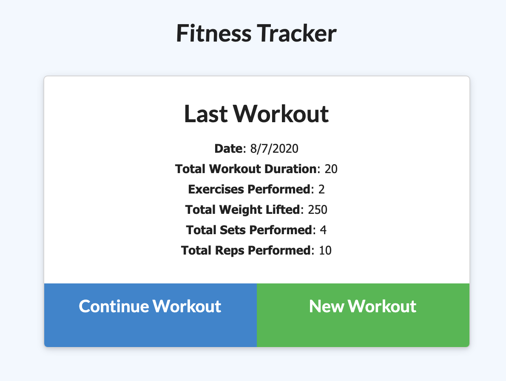

# Workout-Tracker

### [Deployed](https://evening-shore-51189.herokuapp.com/) Link

 Final Product Preview
 

    

  
## Summary & Process
For this assignment, our objective was to create an app that allows the user to track their workout routines; we were provided to client side js and styling. 

I completed the project in the following order: server.js, html routes, api routes, and final adjustments to client side js to ensure tradeoff was established. 

## Table of Contents
* [Takeaways](#takeaways)

* [Technologies Used](#technologies_used)

* [Contact](#contact)
______________

Graphical Output

    

Main Screen / Previous Workout Recap 

    

## Takeaways
Make sure to thoroughly understand the existing code base before diving in. Be very cautious when and how you hand off information from the front end to the back end. 

## Technologies_Used

- MongoDB
- Node.js / Javascript / ES6 
- NPM / Express
- Visual Studio Code
- Git / GitHub / Heroku

## Contact

* [Colin Whitcomb](https://github.com/Colin-Whitcomb)
* [LinkedIn](https://www.linkedin.com/in/colin-whitcomb-b808301a6/)
* [Portfolio](https://pacific-sea-84511.herokuapp.com/)